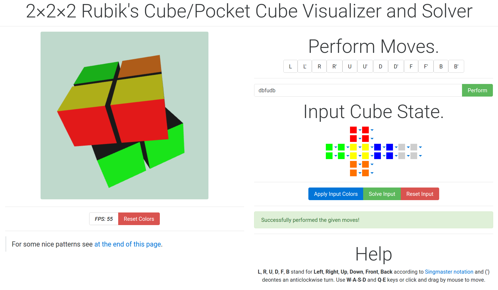

# Pocket-Cube
Minified (CSS/JS/HTML) version of a pocket cube (2x2x2 Rubik's Cube). Visualizer and Solver.
## Screenshot

# Help
- Use W-A-S-D and Q-E to move the cube, or use mouse click and drag.
- 12 Buttons (L/L'/R...) for rotating the cube according to Singmaster's Notation relative to you!
- Can also enter moves sequence Case Insensitively and perform, e.g. LRUf'B
- Can also enter a pocket cube state and find a solution, also loading the given state onto the visualizer. (Note that impossible states are not checked).

# Solution
Solution is based on two-sided Breadth-First-Search that attempts to solve thre adjacent sides, since other three sides will get solved automatically.
